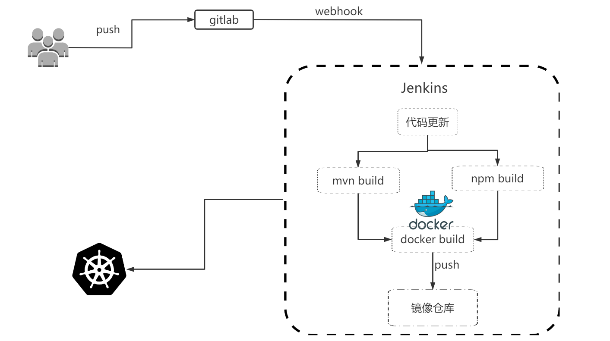

## https://github.com/chaiyd/jenkins.git

## jenkins
* docker pull chaiyd/jenkins:2.249.2
* 使用Jenkins官方dokerfile进行更改，更换war包源地址默认为LTS
* 默认使用jenkins 用户.
* build时，需指定版本号，默认为LTS版最新版
* JENKINS_VERSION=jenkins版本号，注LTS版
* JENKINS_URL 可指定完整的url
* 镜像中包含maven-3.6.1
* 默认已安装npm,cnpm

---
* Use Jenkins official dokerfile to change, update the war package source address default to LTS. 
* Use jenkins user by default.
* When building, you need to specify the version number,The default is the latest version of lts version
* JENKINS_VERSION=jenkins for LTS number.
* JENKINS_URL = jenkins war download url.
* The default will install npm cnpm
---

## build & run
* docker build --build-arg JENKINS_VERSION=2.235.4 -t jenkins:2.235.4 .
* docker-compose up -d

## jenkinsfile
* jenkinsfile ci-cd模板

## ci-cd

